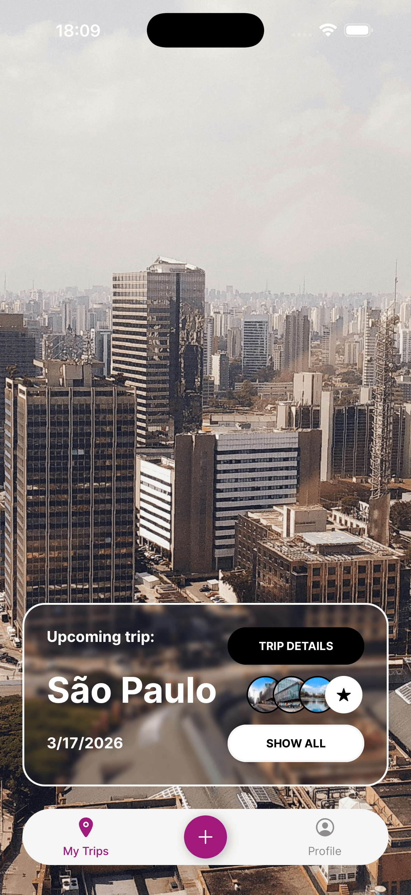
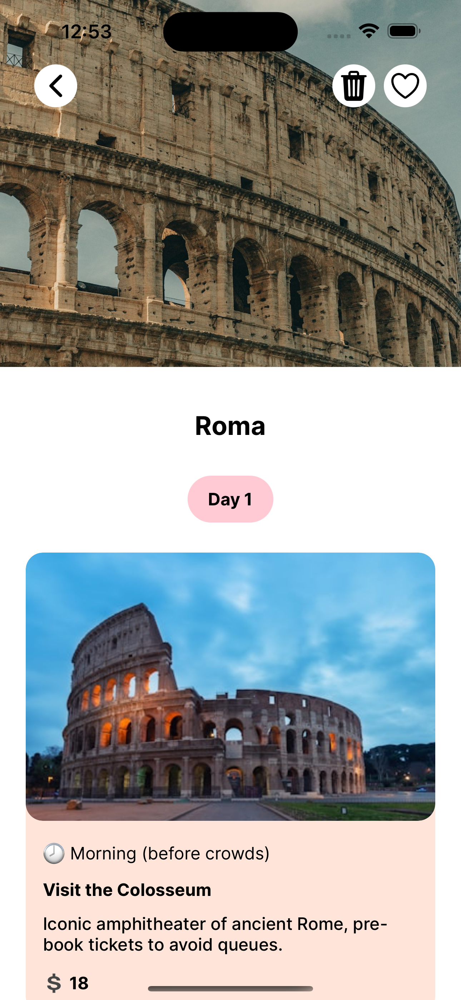

<div align="center">
        
    <h1>
            HolidAI
    </h1>
</div>

A smart travel planning assistant that leverages Google Gemini AI to create personalized trip itineraries. Simply input your destination, travel dates, budget, and number of travelers to receive customized travel plans tailored specifically to your needs - eliminating hours of research and planning.

This is an [Expo](https://expo.dev) project created with [`create-expo-app`](https://www.npmjs.com/package/create-expo-app).

## Screenshots

<table>
   <tr>
      <td><strong>Home Page</strong><br></td>
      <td><strong>Detail Page</strong><br></td>
   </tr>
</table>

## Get started with the development build

1. Install dependencies

   ```bash
   npm install
   ```

2. Build the app

   ```bash
    npm run ios && npm run android
   ```

3. Run the app

   ```bash
    npm run start
   ```

## Setup Instructions

To run this project, you'll need to:

1. Add the following configuration files to the root project directory:

   - `google-services.json` (for Android)
   - `GoogleService-Info.plist` (for iOS)

2. Create environment variables as specified in the `.env.sample` file.

These files contain necessary configuration for Google services integration and environment-specific settings.
