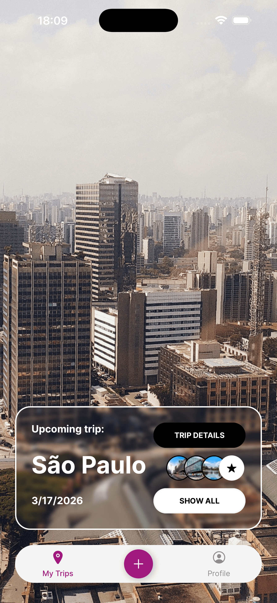
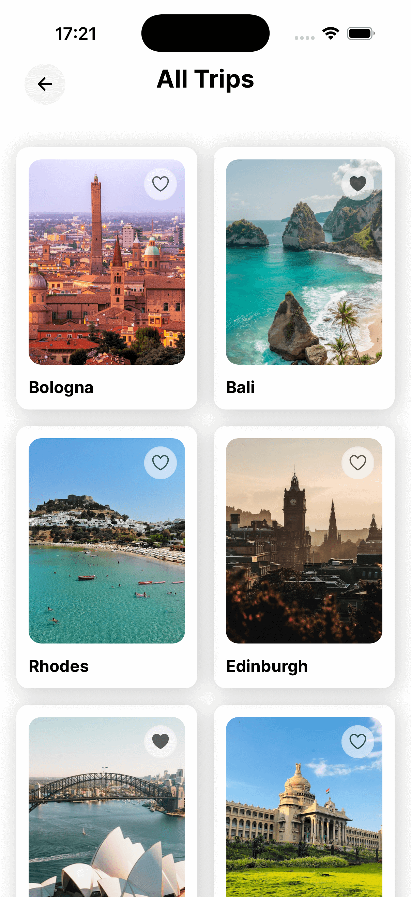
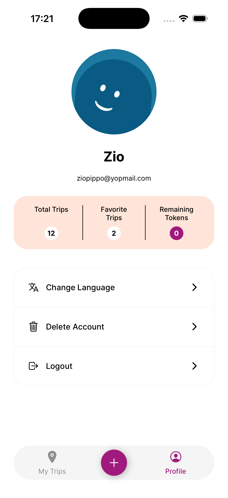
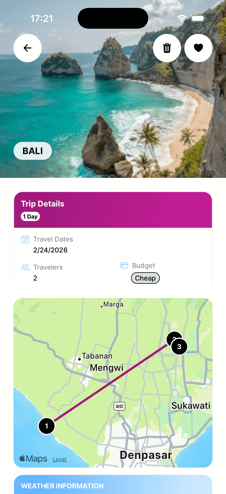

<div align="center">
        
    <h1>
            HolidAI
    </h1>
</div>

A smart travel planning assistant that leverages Google Gemini AI to create personalized trip itineraries. Simply input your destination, travel dates, budget, and number of travelers to receive customized travel plans tailored specifically to your needs - eliminating hours of research and planning.

## AI Model

HolidAI is powered by Google's Gemini 2.5 Flash model, a state-of-the-art large language model specifically optimized for fast, efficient responses while maintaining high-quality outputs. The model is particularly well-suited for travel planning tasks due to its:

- **Speed**: The "Flash" variant is optimized for rapid response generation, ensuring quick itinerary creation
- **Context Understanding**: Advanced natural language processing capabilities to understand complex travel requirements
- **Personalization**: Ability to consider multiple factors like budget, preferences, and constraints when creating travel plans
- **Knowledge Base**: Extensive training on travel-related data, including destinations, activities, and cultural information
- **Real-time Information**: Integration with Google Search to provide up-to-date information about destinations, events, and travel conditions

The model processes user inputs through a carefully designed prompt engineering system that ensures consistent, relevant, and practical travel recommendations.

## Features

- 🤖 **AI-Powered Planning**: Get personalized travel itineraries generated by Google's Gemini AI
- 📅 **Smart Scheduling**: Automatic day-by-day planning based on your preferences
- 💰 **Budget Management**: Get recommendations that fit your budget constraints
- 🗺️ **Interactive Maps**: Visualize your travel plans with integrated maps
- 📱 **Cross-Platform**: Available on both iOS and Android devices

## Tech Stack

- **Frontend**: React Native with Expo
- **AI Integration**: Google Gemini 2.5 Flash with Vercel AI SDK
- **Maps**: Google Maps API and Apple Maps
- **Authentication**: Clerk Authentication
- **Database**: Convex
- **Client State Management**: Zustand
- **Caching and Server State Management**: Tanstack Query
- **Dependency Injection**: tsyringe
- **Linting**: Biome
- **Git hooks manager**: Lefthook
- **Internationalization**: i18next with react-i18next
- **Push Notifications**: WIP - Expo Push Notifications
- **Error Monitoring**: Sentry

## Screenshots

<table>
   <tr>
      <td><strong>Home Page</strong><br></td>
      <td><strong>All Trips Page</strong><br></td>
   </tr>
   <tr>
      <td><strong>Profile Page</strong><br></td>
      <td><strong>Trip Detail Page</strong><br></td>
   </tr>
</table>

## Setup Instructions

To run this project, you'll need to:

1. Add the following configuration files to the root project directory:

   - `google-services.json` (for Android)
   - `GoogleService-Info.plist` (for iOS)

2. Create environment variables as specified in the `.env.sample` file.

These files contain necessary configuration for Google services integration and environment-specific settings.

## Environment Variables

Create a `.env` file in the root directory with the following variables:

### Google Services

- `GOOGLE_PLACES_API_KEY`: API key for Google Places API
- `GOOGLE_MAPS_API_KEY_IOS`: API key for Google Maps on iOS
- `GOOGLE_MAPS_API_KEY_ANDROID`: API key for Google Maps on Android
- `GOOGLE_GEMINI_API_KEY`: API key for Google Gemini AI

To obtain these values:

1. Go to the [Google Cloud Console](https://console.cloud.google.com/)
2. Create a new project or select an existing one
3. Enable the required APIs (Places API, Geocoding, Maps SDK for iOS/Android, Gemini API)
4. Create credentials (API keys) for each service

### Other Services

- `RAPID_API_KEY`: API key for RapidAPI (used for flight information)
  - Sign up at [RapidAPI](https://rapidapi.com/) and subscribe to the Sky Scrapper API
- `UNSPLASH_ACCESS_KEY`: API key for Unsplash (used for destination images)
  - Sign up at [Unsplash Developers](https://unsplash.com/developers) to get an access key
- `MMKV_ENCRYPTION_KEY`: A secure random string for encrypting local storage
  - Generate a secure random string (at least 32 characters)
- `CLERK_PUBLISHABLE_KEY`: API key for Clerk authentication
- `CLERK_JWT_ISSUER_DOMAIN`: JWT issuer domain for Clerk authentication
- `CONVEX_URL`: URL for your Convex deployment
- `OPEN_AI_API_KEY`: API key for OpenAI (optional, for alternative AI features)
- `SENTRY_DSN`: Sentry DSN for error monitoring/session replay

## Get started with the development build

1. Install dependencies

   ```bash
   npm install
   ```

2. Prebuild the app

   ```bash
   npx expo prebuild --clean npm run android

   or

   npx expo prebuild --clean npm run ios
   ```

3. To run on a specific platform with a clean cache:

   ```bash
   npx expo start --clear --ios

   or

   npx expo start --clear --android
   ```

## Documentation

Architecture, error handling, and coding conventions are documented in [`wiki/docs/`](wiki/docs/).

- [Architecture](wiki/docs/ARCHITECTURE.md)
- [Error Handling](wiki/docs/ERROR_HANDLING.md)
- [Performance Conventions](wiki/docs/PERFORMANCE_CONVENTIONS.md)

---

## Contributing

We welcome contributions to HolidAI! Here's how you can help:

### Finding Issues to Work On

We have a variety of open issues that need attention! You can find them in our [Issues](https://github.com/timothyrusso/HolidAI/issues) section. Issues are labeled with different categories:

- 🐛 `bug` - Issues that need to be fixed
- ✨ `enhancement` - New features or improvements
- 📝 `documentation` - Documentation updates
- 🎯 `product` - Product-related tasks and improvements
- ⚡ `technical_improvement` - Technical improvements, performance issues, or library updates

Feel free to pick up any issue that interests you. If you're new to the project, look for issues labeled with `good first issue` or `help wanted`.

### Getting Started

1. Fork the repository
2. Clone your fork:
   ```bash
   git clone https://github.com/timothyrusso/HolidAI.git
   ```
3. Create a new branch:
   ```bash
   git checkout -b feature/issue-number
   ```

### Development Process

1. Setup and run the project
2. Make your changes
3. Run tests (if available)
4. Commit your changes with clear commit messages
5. Push to your fork
6. Create a Pull Request

### AI-Assisted Code Review

Pull requests are automatically reviewed by multiple AI-powered code review tools that help catch issues and suggest improvements before human review:

- 🧙‍♂️ [Sourcery](https://sourcery.ai) — refactoring suggestions and code quality improvements
- 🐇 [CodeRabbit](https://coderabbit.ai) — line-by-line review with context-aware feedback
- 🤖 [Gemini Code Assist](https://cloud.google.com/gemini/docs/codeassist/overview) — Google's AI-powered code review assistant

### Pull Request Guidelines

- Ensure your PR description clearly describes the changes
- Include screenshots for UI changes
- Update documentation if necessary
- Follow the existing code style
- Make sure all tests pass

### Code of Conduct

Please be respectful and considerate of others when contributing. We aim to foster an inclusive and welcoming community.

### Questions?

Feel free to open an issue for any questions or concerns you might have about contributing.
